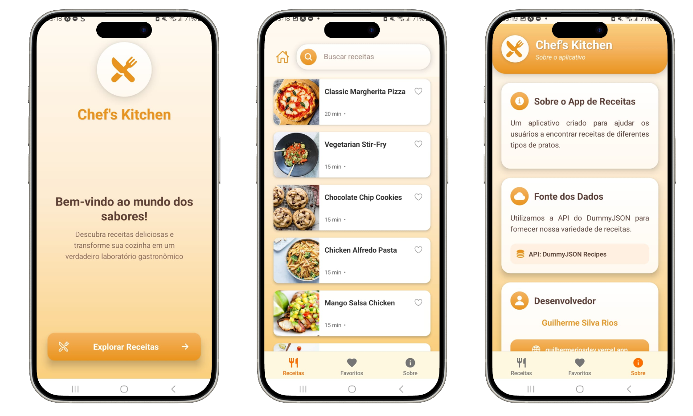
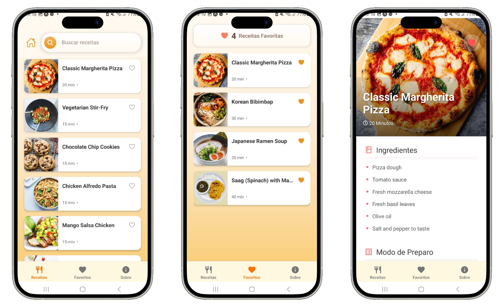

# 🍳 Chef's Kitchen

**Chef's Kitchen** é um aplicativo de receitas que permite aos usuários explorar, pesquisar e salvar suas receitas favoritas.  
Com uma interface intuitiva e amigável, é possível navegar por uma vasta coleção de pratos, visualizar detalhes de preparo e manter uma lista de favoritos para acesso rápido.

---

## 📱 Telas do Aplicativo

<div style="display: flex;">


</div>

---

## 🚀 Tecnologias Utilizadas

- **React Native** – Framework para criação de aplicativos móveis nativos usando JavaScript e React.  
- **Expo** – Framework e plataforma para apps universais React.  
- **Expo Router** – Sistema de roteamento baseado em arquivos para React Native e Web.  
- **TypeScript** – Superset do JavaScript com tipagem estática opcional.  
- **React Context API** – Gerenciamento de estado global.  
- **AsyncStorage** – Persistência de dados no dispositivo.

---

## ✨ Funcionalidades

- **Explorar Receitas** – Lista de receitas obtidas de uma API externa.  
- **Pesquisar Receitas** – Busca de pratos pelo nome.  
- **Favoritos** – Salvar e remover receitas favoritas.  
- **Detalhes da Receita** – Ingredientes e modo de preparo detalhados.  
- **Navegação por Abas** – Alternância rápida entre Receitas, Favoritos e Sobre.

---

## 📂 Estrutura do Projeto

```
guilhermeprog3/recipe/Recipe-0871b566b92bdf1d969be866e13d741c6e51ce2c/
├── src/
│   ├── app/
│   │   ├── (screens)/
│   │   │   ├── about.tsx
│   │   │   ├── favorite.tsx
│   │   │   ├── recipes/
│   │   │   │   └── [id].tsx
│   │   │   ├── recipes.tsx
│   │   │   └── _layout.tsx
│   │   ├── components/
│   │   │   └── card-recipe.tsx
│   │   ├── index.tsx
│   │   └── _layout.tsx
│   ├── context/
│   │   └── recipecontext.tsx
│   ├── hooks/
│   │   └── recipe.ts
│   └── types/
│       └── recipe.ts
├── app.json
├── package.json
└── tsconfig.json
```

**Descrição das pastas:**
- **src/app/** – Telas e navegação do app.  
- **src/app/(screens)/** – Telas principais (Receitas, Favoritos, Sobre, etc.).  
- **src/app/components/** – Componentes reutilizáveis como cards de receita.  
- **src/context/** – Estado global do app (receitas e favoritos).  
- **src/hooks/** – Hooks personalizados para acessar o contexto.  
- **src/types/** – Definições de tipos do TypeScript.  
- **app.json** – Configuração do Expo.  
- **package.json** – Dependências e scripts.  
- **tsconfig.json** – Configuração do TypeScript.

---

## 🛠️ Instalação e Execução

1. **Clone o repositório**
   ```bash
   git clone https://github.com/GuilhermeRiosDev/Recipe.git
   ```

2. **Acesse o diretório**
   ```bash
   cd Recipe
   ```

3. **Instale as dependências**
   ```bash
   npm install
   # ou
   yarn install
   ```

4. **Inicie o servidor de desenvolvimento**
   ```bash
   npm start
   # ou
   yarn start
   ```

5. **Execute no dispositivo ou simulador**
   - Escaneie o QR Code com o **Expo Go** (Android ou iOS).  
   - Pressione **a** para Android ou **i** para iOS no terminal.

---

## 📬 Contato

👤 **Desenvolvedor:** Guilherme Silva Rios  
🌐 [Portfólio](https://guilhermeriosdev.vercel.app)  
💻 [GitHub](https://github.com/guilhermeprog3)  
